<p align="center">
  
</p>

<h1 align="center">Greenwich Foot Tunnel Lifts for Home Assistant</h1>

<p align="center">
  Custom <a href="https://www.home-assistant.io/">Home Assistant</a> integration exposing live crowdsourced lift status for the <a href="https://en.wikipedia.org/wiki/Greenwich_foot_tunnel">Greenwich Foot Tunnel</a> &mdash; the Victorian pedestrian crossing under the Thames between Island Gardens and Cutty Sark.<br>
  Two binary sensors, a dedicated Lovelace card with full edit-mode UI, and a polished rotunda illustration for dashboards.
</p>

<p align="center">
  <a href="https://github.com/hypercubian/ha-greenwichtunnel/releases"></a>
  <a href="https://github.com/hypercubian/ha-greenwichtunnel/releases"></a>
  <a href="https://github.com/hypercubian/ha-greenwichtunnel/stargazers"></a>
  <a href="LICENSE"></a>
</p>
<p align="center">
  <a href="https://hacs.xyz/"></a>
  
  <a href="https://github.com/hypercubian/ha-greenwichtunnel/actions/workflows/ci.yml"></a>
  <a href="https://github.com/psf/black"></a>
  <a href="https://mypy-lang.org/"></a>
</p>

<p align="center">
  <a href="https://my.home-assistant.io/redirect/hacs_repository/?owner=hypercubian&repository=ha-greenwichtunnel&category=integration">
    
  </a>
</p>

<p align="right">
  <a href="https://github.com/hypercubian"></a>
</p>

---

<p align="center">
  
</p>

## What it does

The Royal Borough of Greenwich operates two Victorian-era pedestrian tunnels under the Thames. The one at Greenwich, linking Island Gardens (north) to Cutty Sark (south), has two lifts that break frequently and nobody publishes a live feed. This integration pulls from [greenwichlifts.co.uk](https://www.greenwichlifts.co.uk/), a crowdsourced tracker built by Andreas Nikolaou after the council's hardware-monitored [LiftCheck](https://www.rossatkin.com/wp/?portfolio=foot-tunnel-lift-info-system) system went dark in January 2024. Commuters sign in and report whether each lift is working as they pass through; this integration polls the same public Supabase backend that the website reads from, so the Home Assistant state tracks the community view in near real time.

## Entities

| Entity | Device class | Meaning | Attributes |
| --- | --- | --- | --- |
| `binary_sensor.greenwich_foot_tunnel_lifts_north_lift_island_gardens` | `running` | on = lift is functioning, off = broken | `last_report_at`, `last_report_created`, `report_count_24h`, `availability_pct_24h`, `is_stale` |
| `binary_sensor.greenwich_foot_tunnel_lifts_south_lift_cutty_sark` | `running` | on = lift is functioning, off = broken | (as above) |

### Attribute reference

| Attribute | Meaning |
| --- | --- |
| `last_report_at` | User-observed time of the most recent report (UTC, ISO 8601) |
| `last_report_created` | When the report was submitted to the backend |
| `report_count_24h` | Number of reports seen for this lift in the last 24 hours |
| `availability_pct_24h` | Share of those reports with status "functioning", 0&ndash;100 |
| `is_stale` | `true` if the most recent report is more than 6 hours old. The binary sensor still reflects the last known value so your automations have something to react to &mdash; branch on this attribute if you want to treat stale data as unknown |

If no reports at all have been submitted for a lift in the last 24 hours the entity becomes `unavailable`.

## Lovelace card

The integration ships a bundled dynamic Lovelace card (`custom:greenwich-tunnel-card`) that renders both panels side-by-side with the original rotunda illustrations, pill badges, and status icons. The card is a native web component &mdash; all text is HTML+CSS (no baked-in SVG text), so it stays crisp and legible at any card size and can be configured from the dashboard edit UI.

### Minimal config

```yaml
type: custom:greenwich-tunnel-card
north_entity: binary_sensor.greenwich_foot_tunnel_lifts_north_lift_island_gardens
south_entity: binary_sensor.greenwich_foot_tunnel_lifts_south_lift_cutty_sark
```

### Full config with every option

```yaml
type: custom:greenwich-tunnel-card
# --- entities (required) ---
north_entity: binary_sensor.greenwich_foot_tunnel_lifts_north_lift_island_gardens
south_entity: binary_sensor.greenwich_foot_tunnel_lifts_south_lift_cutty_sark
# --- labels (optional, defaults shown) ---
title: "Greenwich foot tunnel"
subtitle: "Elevator status"
footer: "370m under the Thames"
north_label: "North"
north_entrance: "Island Gardens"
south_label: "South"
south_entrance: "Cutty Sark"
working_text: "Working"
broken_text: "Out of service"
# --- show/hide elements ---
show_rotunda: true
show_pill: true
show_icon: true
# --- typography ---
font_scale: 1.0            # multiplier on the responsive defaults (0.5-2.5)
title_size: 24             # absolute px overrides; omit to use responsive clamp
subtitle_size: 16
panel_label_size: 22
panel_entrance_size: 14
pill_size: 16
footer_size: 12
# --- spacing ---
card_padding: 20           # outer card padding (px)
panel_padding: 16          # inside each panel (px)
panel_gap: 12              # horizontal gap between the two panels (px)
gap_rotunda_title: 8       # vertical gaps inside each panel
gap_title_subtitle: 2
gap_subtitle_pill: 6
gap_pill_icon: 6
```

### Edit-mode UI

Every field above is exposed as an HA-native form element when you click the pencil icon on the card in dashboard edit mode:

- **Entity pickers** for both lifts (filtered to `binary_sensor`)
- **Text fields** for the ten label/text overrides, grouped into north-side, south-side, and working/broken pairs
- **Checkbox row** for `show_rotunda` / `show_pill` / `show_icon`
- **Sliders** for `font_scale` (0.5&ndash;2.5) and the four spacing values (0&ndash;40 px each)
- **Sliders** for the six text-size overrides (8&ndash;48 px each); any untouched slider falls back to the responsive default

Fields at their defaults are stripped from the saved YAML so the stored card config stays minimal.

### How the dynamic rendering works

- The card is a plain Web Component registered as `<greenwich-tunnel-card>`
- State comes from the two `binary_sensor` entities; the card re-renders on state change via the `hass` setter
- All state-dependent colours flow through CSS variables (`--pill-bg`, `--rc-dark`, etc.), so flipping from working to out-of-service is a one-line property swap per panel
- Typography uses CSS `clamp()` and `cqi` (container query inline size) units, so text scales with the card's rendered width rather than with the SVG viewBox
- An `unavailable` state renders a neutral grey "Unknown" pill while keeping the rotunda silhouette

## Installation

### HACS (recommended)

> **Don't have HACS?** Follow the [official HACS installation guide](https://hacs.xyz/docs/use/download/download/) first.

1. Open HACS in your Home Assistant instance
2. Go to **Integrations** &rarr; three-dot menu &rarr; **Custom repositories**
3. Add `https://github.com/hypercubian/ha-greenwichtunnel` with category **Integration**
4. Search for "Greenwich Foot Tunnel Lifts" and install
5. Restart Home Assistant
6. **Settings** &rarr; **Devices & Services** &rarr; **Add Integration** &rarr; **Greenwich Foot Tunnel Lifts** &rarr; Submit

After step 5, the custom Lovelace card becomes available in the dashboard card picker (listed as "Greenwich Tunnel") with no additional resource registration required &mdash; the integration registers the card JS as an extra frontend module at setup.

### Manual

1. Copy the `custom_components/greenwich_tunnel` directory into your Home Assistant `config/custom_components/` folder
2. Restart Home Assistant
3. Add the integration from **Settings** &rarr; **Devices & Services** &rarr; **Add Integration**

## Configuration

The integration itself has nothing to configure &mdash; the config flow validates connectivity to the upstream API and creates both entities automatically. Only one instance can be added per Home Assistant.

## Technical details

- **Data source:** `https://uhgfgayyfbtjlttescvv.supabase.co/rest/v1/reports` (public Supabase REST, the same backend the greenwichlifts.co.uk frontend reads from)
- **Auth:** public Supabase anon key embedded in the upstream site; row-level-security filtered, no personal data accessible
- **Polling:** 5-minute `DataUpdateCoordinator` interval, well above the 60-second cloud-polling floor
- **Aggregation:** each poll fetches the last 24 hours of reports in a single request and computes latest status by `created_at`, availability %, count, and the stale flag per location
- **Latest-decision rule:** uses server-side `created_at` rather than user-entered `timestamp`, so contributor-device clock drift doesn't affect status
- **Frontend delivery:** the integration registers `/greenwich_tunnel_frontend/` as an HTTP static path and adds the card JS to the frontend via `frontend.add_extra_js_url` during `async_setup_entry`; no manual resource registration needed
- **Requires Home Assistant 2026.3+** (uses the embedded Brands Proxy API for icons)

## Data quality caveats

- The feed is crowdsourced, not authoritative. A silent overnight breakdown may not surface until the first cyclist through in the morning reports it.
- The Royal Borough of Greenwich publishes 30-day availability figures on [its official status page](https://www.royalgreenwich.gov.uk/parking-transport-and-streets/travel-foot-bike-or-public-transport/check-status-foot-tunnels) but that page is updated manually and is not a live feed.
- The Woolwich Foot Tunnel is not covered by this integration &mdash; the upstream tracker only monitors the Greenwich crossing.

## Contributing

1. Clone the repo
2. Install dependencies: `poetry install`
3. Install pre-commit hooks: `poetry run pre-commit install`
4. Run tests: `poetry run pytest tests/unit/`

The Lovelace card is in `custom_components/greenwich_tunnel/frontend/greenwich-tunnel-card.js` &mdash; plain ES6, no build step, no bundler. Edit in place and bump `CARD_VERSION` when releasing.

The brand-asset generator for the integration's HA icons lives at `brand/generate_brand_assets.py`. A secondary generator at `brand/generate_tile_variants.py` produces the pre-rendered static tile SVGs used in this README; they are not shipped with the integration.

## License

[MIT](LICENSE)
