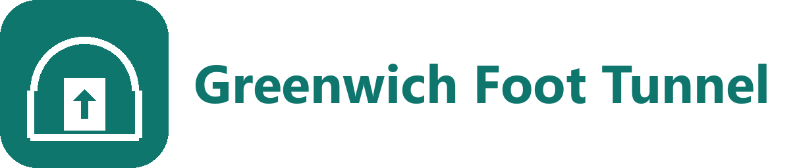

  

<h1 align="center">Greenwich Foot Tunnel Lifts for Home Assistant</h1>

  Custom <a href="https://www.home-assistant.io/">Home Assistant</a> integration exposing live crowdsourced lift status for the <a href="https://en.wikipedia.org/wiki/Greenwich_foot_tunnel">Greenwich Foot Tunnel</a> &mdash; the Victorian pedestrian crossing under the Thames between Island Gardens and Cutty Sark. 
  Know when each lift is broken before you've cycled to the entrance.

  
  
  
  

  
  
  
  
  

  

 
 
 

  

---

## Data source

Data comes from [greenwichlifts.co.uk](https://www.greenwichlifts.co.uk/), a crowdsourced tracker built by Andreas Nikolaou after the council's hardware-monitored [LiftCheck](https://www.rossatkin.com/wp/?portfolio=foot-tunnel-lift-info-system) system went dark in January 2024. Commuters sign in and report whether each lift is working as they pass through; this integration polls the same public Supabase backend that the website reads from, so the HA state tracks the community view in near real time.

| Lift | Entrance | Binary sensor | Device class |
| --- | --- | --- | --- |
| North | Island Gardens | `binary_sensor.greenwich_foot_tunnel_lifts_north_lift_island_gardens` | `running` |
| South | Cutty Sark (Greenwich) | `binary_sensor.greenwich_foot_tunnel_lifts_south_lift_cutty_sark` | `running` |

`on` = functioning, `off` = broken. Each sensor also exposes:

| Attribute | Meaning |
| --- | --- |
| `last_report_at` | User-observed time of the most recent report (UTC, ISO 8601) |
| `last_report_created` | When the report was submitted to the backend |
| `report_count_24h` | Number of reports seen for this lift in the last 24 hours |
| `availability_pct_24h` | Share of those reports with status "functioning", 0&ndash;100 |
| `is_stale` | `true` if the most recent report is more than 6 hours old. The binary sensor still reflects the last known value so your automations have something to react to &mdash; branch on this attribute if you want to treat stale data as unknown |

If no reports at all have been submitted for a lift in the last 24 hours the entity becomes `unavailable`.

## Installation

### HACS (recommended)

> **Don't have HACS?** Follow the [official HACS installation guide](https://hacs.xyz/docs/use/download/download/) first.

1. Open HACS in your Home Assistant instance
2. Go to **Integrations** &rarr; three-dot menu &rarr; **Custom repositories**
3. Add `https://github.com/hypercubian/ha-greenwichtunnel` with category **Integration**
4. Search for "Greenwich Foot Tunnel Lifts" and install
5. Restart Home Assistant

### Manual

1. Copy the `custom_components/greenwich_tunnel` directory into your Home Assistant `config/custom_components/` folder
2. Restart Home Assistant

## Configuration

1. Go to **Settings** &rarr; **Devices & Services** &rarr; **Add Integration**
2. Search for **Greenwich Foot Tunnel Lifts**
3. Press **Submit**

There is nothing to configure &mdash; the integration validates connectivity to the upstream API and creates both entities automatically. Only one instance can be added at a time.

## Technical details

- **Data source:** `https://uhgfgayyfbtjlttescvv.supabase.co/rest/v1/reports` (public Supabase REST, the same backend the greenwichlifts.co.uk frontend reads from)
- **Auth:** public Supabase anon key embedded in the upstream site; row-level-security filtered, no personal data accessible
- **Polling:** 5-minute `DataUpdateCoordinator` interval, well above the 60-second cloud-polling floor
- **Aggregation:** each poll fetches the last 24 hours of reports in a single request and computes latest status by `created_at`, availability %, count, and the stale flag per location
- **Latest-decision rule:** uses server-side `created_at` rather than user-entered `timestamp`, so contributor-device clock drift doesn't affect status
- **Requires Home Assistant 2026.3+** (uses the embedded Brands Proxy API for icons)

## Data quality caveats

- The feed is crowdsourced, not authoritative. A silent overnight breakdown may not surface until the first cyclist through in the morning reports it.
- The Royal Borough of Greenwich publishes 30-day availability figures on [its official status page](https://www.royalgreenwich.gov.uk/parking-transport-and-streets/travel-foot-bike-or-public-transport/check-status-foot-tunnels) but that page is updated manually and is not a live feed.
- The Woolwich Foot Tunnel is not covered by this integration &mdash; the upstream tracker only monitors the Greenwich crossing.

## Contributing

1. Clone the repo
2. Install dependencies: `poetry install`
3. Install pre-commit hooks: `poetry run pre-commit install`
4. Run tests: `poetry run pytest tests/unit/`

## License

[MIT](LICENSE)
